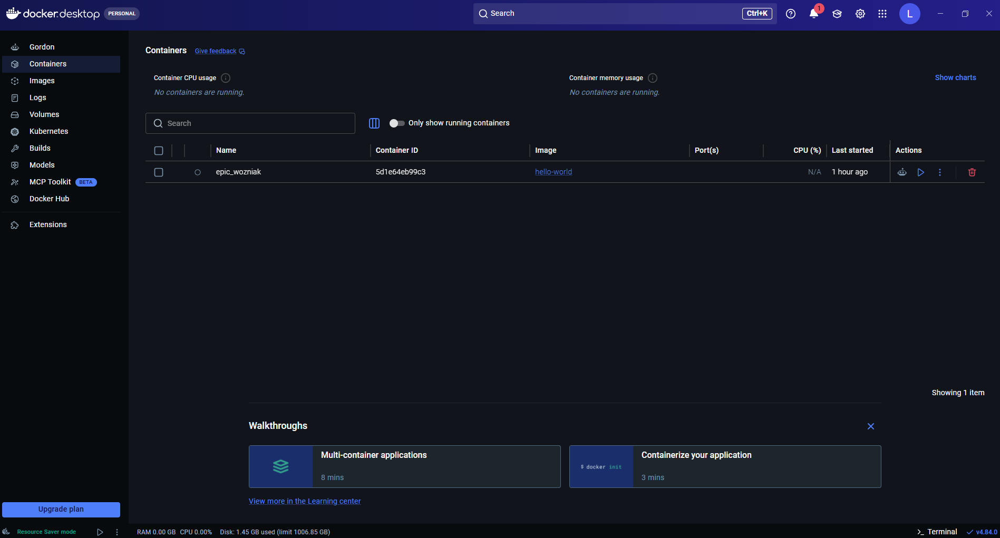

# Capítulo 01 · Preparación del entorno de desarrollo – Instalación de Docker Desktop sobre Windows 11 con WSL2

> Proyecto: **AI Automation Journey**

---

# Introducción

Antes de comenzar a trabajar con **n8n**, es necesario preparar un entorno de desarrollo confiable y estable. En este capítulo se realiza la instalación y configuración de **Docker Desktop** sobre **Windows 11** utilizando **WSL2 (Windows Subsystem for Linux)** como backend.

Además del proceso de instalación, se documentan las validaciones realizadas, los problemas encontrados durante la configuración y las soluciones aplicadas hasta obtener un entorno completamente funcional para la ejecución de contenedores.

---

# Objetivo

## Objetivo general

Preparar un entorno de desarrollo estable para ejecutar **n8n** utilizando Docker Desktop, estableciendo una base sólida para el resto del proyecto **AI Automation Journey**.

## Objetivos específicos

- Comprender por qué **n8n** se ejecutará sobre Docker.
- Instalar correctamente **WSL2**.
- Instalar **Ubuntu** como distribución Linux.
- Configurar Docker Desktop para utilizar **WSL2**.
- Validar que **Docker Engine** funcione correctamente.
- Resolver los problemas encontrados durante la instalación.
- Obtener un entorno listo para desplegar contenedores.

---

# Conceptos principales

## Docker Desktop

Aplicación que facilita la administración y ejecución de contenedores Docker sobre Windows.

## WSL2

Windows Subsystem for Linux versión 2 proporciona un kernel Linux dentro de Windows, permitiendo que Docker ejecute contenedores Linux de manera eficiente.

## Ubuntu

Distribución Linux utilizada como entorno de ejecución para Docker mediante WSL2.

## Docker Engine

Motor responsable de descargar imágenes y ejecutar contenedores.

## Contenedor

Instancia en ejecución de una imagen Docker.

---

# Desarrollo

## Arquitectura objetivo

```text
                Windows 11
                     │
                     ▼
      Windows Subsystem for Linux (WSL2)
                     │
                     ▼
                  Ubuntu
                     │
                     ▼
              Docker Desktop
                     │
                     ▼
               Docker Engine
                     │
                     ▼
                Contenedores
                     │
                     ▼
                    n8n
```

---

## Componentes involucrados

| Componente | Función |
|------------|----------|
| Windows 11 | Sistema operativo anfitrión |
| WSL2 | Proporciona un kernel Linux dentro de Windows |
| Ubuntu | Distribución Linux utilizada por Docker |
| Docker Desktop | Interfaz gráfica y administración de Docker |
| Docker Engine | Motor encargado de ejecutar contenedores |
| Docker Hub | Registro desde donde se descargan las imágenes |
| PowerShell | Consola utilizada para las validaciones |

---

## Configuración del entorno

### Sistema operativo

- Windows 11

### Plataforma

- 64 Bits (AMD64)

### Virtualización

- Virtualización habilitada.

### Distribución Linux

- Ubuntu instalada mediante WSL2.

### Docker

- Docker Desktop

Configurado para utilizar:

- WSL2 Backend

### Arquitectura seleccionada

```text
Windows
   │
   ▼
WSL2
   │
   ▼
Ubuntu
   │
   ▼
Docker Engine
```

---

## Comandos utilizados

### Verificar WSL

```bash
wsl --status
```

**Objetivo**

Comprobar que WSL estuviera correctamente instalado.

---

### Listar distribuciones

```bash
wsl -l -v
```

**Objetivo**

Verificar que Ubuntu estuviera instalada y utilizando la versión 2.

---

### Verificar Docker

```bash
docker version
```

**Objetivo**

Validar la comunicación entre el cliente Docker y el Engine.

---

### Información del motor

```bash
docker info
```

**Objetivo**

Obtener información completa del Engine.

---

### Validación final

```bash
docker run hello-world
```

**Objetivo**

Descargar una imagen oficial y ejecutar el primer contenedor.

---

# Validaciones

Durante la instalación se realizaron las siguientes comprobaciones.

## Validación 1

**WSL instalado correctamente.**

**Resultado esperado**

```text
Default Version: 2
```

---

## Validación 2

**Ubuntu instalada correctamente.**

**Resultado esperado**

```text
Ubuntu
VERSION 2
```

---

## Validación 3

**Docker Desktop iniciado.**

**Resultado esperado**

```text
Engine running
```

---

## Validación 4

**Contenedor de prueba ejecutado.**

**Resultado esperado**

```text
Hello from Docker!
```

---

### Estado final

> ✅ **ÉXITO**

Docker Desktop quedó completamente funcional.

---

# Evidencias

Durante esta sesión se obtuvieron evidencias relacionadas con:

- Instalación de WSL2.
- Instalación de Ubuntu.
- Instalación de Docker Desktop.
- Error del Docker Engine.
- Estado **Starting Docker Engine**.
- Estado **Engine Running**.
- Ejecución satisfactoria de **hello-world**.

> **Nota:** Incorporar las capturas de pantalla almacenadas durante la sesión en las secciones correspondientes para ilustrar tanto los errores encontrados como la solución aplicada.

---

# Problemas encontrados

## Problema 1

Docker Desktop no iniciaba.

## Problema 2

Docker Engine permanecía indefinidamente en:

```text
Starting Docker Engine
```

## Problema 3

El Engine devolvía errores HTTP durante el inicio.

## Problema 4

La instalación inicial se realizó sin tener completamente configurado WSL2.

---

## Diagnóstico

Después del análisis se determinó que el problema no correspondía a Docker Desktop.

La causa era la dependencia de Docker respecto a **WSL2**. Docker requería un entorno Linux completamente funcional para iniciar correctamente el **Docker Engine**.

---

# Soluciones aplicadas

Se ejecutó el siguiente procedimiento:

1. Verificación del estado de WSL.
2. Instalación de Ubuntu.
3. Configuración correcta de WSL2.
4. Desinstalación completa de Docker Desktop.
5. Reinicio del sistema operativo.
6. Instalación limpia de Docker Desktop.
7. Configuración utilizando **WSL2 Backend**.
8. Reinicio del equipo.
9. Primer inicio de Docker Desktop.
10. Validación mediante:

```bash
docker run hello-world
```

**Resultado:** validación exitosa.

---

# Lecciones aprendidas

- Docker Desktop depende de WSL2 para funcionar correctamente en Windows.
- Instalar Docker antes de preparar WSL2 puede generar errores de inicialización.
- No es recomendable ejecutar múltiples cambios simultáneamente sin validar cada paso.
- Una reinstalación limpia es preferible a modificar configuraciones sin un diagnóstico previo.

---

# Buenas prácticas

## Antes de instalar Docker Desktop

- Verificar que la virtualización esté habilitada.
- Confirmar que WSL2 esté instalado.
- Instalar una distribución Linux (Ubuntu).
- Reiniciar el equipo tras la instalación.
- Descargar Docker Desktop únicamente desde la página oficial.
- Configurar Docker para utilizar WSL2.
- Validar el funcionamiento mediante:

```bash
docker run hello-world
```

---

## Durante el diagnóstico

- Analizar el problema antes de aplicar soluciones.
- Cambiar una sola variable a la vez.
- Validar cada modificación antes de continuar.
- Documentar los errores y su resolución para futuras referencias.

---

# Resumen del capítulo

En este capítulo se preparó el entorno de desarrollo necesario para trabajar con **n8n** utilizando **Docker Desktop** sobre **Windows 11** y **WSL2**.

Se instaló y configuró correctamente WSL2, se implementó Ubuntu como distribución Linux, se configuró Docker Desktop para utilizar el backend de WSL2 y se verificó el correcto funcionamiento del Docker Engine mediante la ejecución del contenedor **hello-world**.

También se documentaron los problemas encontrados durante la instalación, el diagnóstico realizado, las soluciones aplicadas y las buenas prácticas que permiten evitar inconvenientes similares en futuras instalaciones.

Con esta configuración, el entorno queda completamente preparado para comenzar a trabajar con contenedores Docker y desplegar n8n en el siguiente capítulo.


---

# Próximo capítulo

## Capítulo 02 · Despliegue de n8n mediante Docker

En el siguiente capítulo se abordarán los siguientes temas:

- Comprender qué es una imagen Docker.
- Diferenciar imagen y contenedor.
- Descargar la imagen oficial de n8n.
- Ejecutar el primer contenedor de n8n.
- Comprender el uso de puertos, volúmenes y variables de entorno.
- Acceder a la interfaz web de n8n.
- Crear el primer workflow.

> Continúa en el siguiente capítulo.